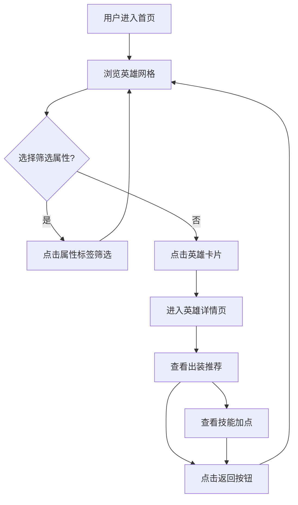

## 1. 产品概述

DOTA2 出装助手是一个面向 DOTA2 玩家的英雄出装推荐网站。用户可以在英雄列表页面浏览所有 DOTA2 英雄（124个），按照力量、敏捷、智力、全才四种属性分类展示，点击任意英雄进入独立详情页查看推荐出装方案。

- 目标用户：DOTA2 玩家，希望快速查询英雄推荐装备
- 核心价值：直观的英雄网格浏览 + 清晰的出装推荐，帮助玩家快速决策

## 2. 核心功能

### 2.1 用户角色

无需注册登录，所有功能对访客公开。

### 2.2 功能模块

1. **英雄列表页（首页）**：英雄分类网格展示，支持按属性筛选
2. **英雄详情页**：展示英雄基本信息、推荐出装（前期/中期/后期装备）、技能加点建议

### 2.3 页面详情

| 页面名称 | 模块名称 | 功能描述 |
|---------|---------|---------|
| 英雄列表页 | 顶部导航栏 | Logo、搜索框、属性筛选标签 |
| 英雄列表页 | 英雄属性分组 | 按力量/敏捷/智力/全才分组，每组显示英雄卡片网格 |
| 英雄列表页 | 英雄卡片 | 英雄头像、名称、属性图标，hover 效果，点击跳转详情 |
| 英雄详情页 | 英雄信息头部 | 英雄头像、名称、属性、攻击类型 |
| 英雄详情页 | 出装推荐区 | 前期装、中期装、后期装三个阶段，每个阶段显示装备图标+名称 |
| 英雄详情页 | 技能加点区 | 技能图标 + 推荐加点顺序 |
| 英雄详情页 | 返回导航 | 返回英雄列表的链接 |

## 3. 核心流程

## 4. 用户界面设计

### 4.1 设计风格

- **主题**：暗色 DOTA2 风格，深色背景 + 金色/琥珀色点缀
- **主色**：深蓝黑背景 `#0a0e17`，金色强调 `#c89b3c`
- **辅色**：力量红 `#e43b3b`、敏捷绿 `#4caf50`、智力蓝 `#3b8ce4`、全才紫 `#9b59b6`
- **字体**：标题使用 Cinzel（哥特风格衬线体，契合 DOTA2 氛围），正文使用 Noto Sans SC
- **卡片风格**：暗色半透明卡片，带细金色边框，hover 时发光效果
- **布局**：网格布局，桌面端 6-8 列，平板 4 列，手机 2 列

### 4.2 页面设计概览

| 页面名称 | 模块名称 | UI 元素 |
|---------|---------|--------|
| 英雄列表页 | 顶部导航 | 深色固定顶栏，Logo + 搜索框 + 4个属性筛选按钮 |
| 英雄列表页 | 属性分组 | 每个属性一个区块，带属性图标和标签，背景微透明 |
| 英雄列表页 | 英雄卡片 | 正方形卡片，英雄肖像占主体，底部显示名称，hover 金色发光边框 |
| 英雄详情页 | 信息头部 | 大英雄肖像左对齐，名称+属性+攻击类型在右侧 |
| 英雄详情页 | 出装区域 | 三个横向排列的阶段卡片，每个内含装备图标网格 3x2 |
| 英雄详情页 | 技能加点 | 4个技能图标横向排列，下方标注推荐加点顺序 |

### 4.3 响应式设计

- 桌面端（>1024px）：英雄卡片 6 列网格，详情页左右布局
- 平板（768-1024px）：英雄卡片 4 列网格，详情页上下布局
- 手机（<768px）：英雄卡片 2 列网格，详情页单列堆叠

## 5. 数据说明

- 英雄数据模拟 DOTA2 全部 124 位英雄，包含名称、属性（力量/敏捷/智力/全才）、头像
- 出装数据为预设推荐数据，包含前期装备、中期装备、后期装备
- 英雄头像使用 DOTA2 官方 CDN 资源
- 装备图标使用 DOTA2 官方 CDN 资源