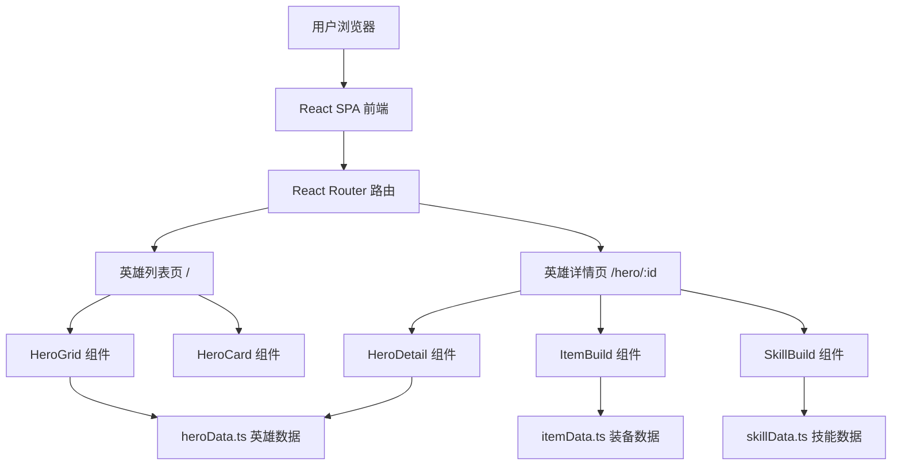

## 1. 架构设计



## 2. 技术说明

- **前端**：React@18 + TypeScript + Tailwind CSS@3 + Vite
- **初始化工具**：vite-init (react-ts 模板)
- **路由**：react-router-dom@6
- **状态管理**：zustand（轻量筛选状态）
- **图标**：lucide-react
- **后端**：无，使用本地 Mock 数据
- **字体**：Cinzel（标题）+ Noto Sans SC（正文），通过 Google Fonts 引入

## 3. 路由定义

| 路由 | 页面 | 说明 |
|------|------|------|
| `/` | 英雄列表页 | 展示全部英雄，支持属性筛选和搜索 |
| `/hero/:id` | 英雄详情页 | 展示英雄信息、出装推荐、技能加点 |

## 4. 数据模型

### 4.1 英雄数据模型

```typescript
interface Hero {
  id: number;
  name: string;           // 中文名
  nameEn: string;         // 英文名
  attribute: 'strength' | 'agility' | 'intelligence' | 'universal';
  attackType: 'melee' | 'range';
  roles: string[];        // 定位标签
  portraitUrl: string;    // 英雄头像 URL
}
```

### 4.2 装备数据模型

```typescript
interface Item {
  id: number;
  name: string;
  nameEn: string;
  cost: number;
  iconUrl: string;
  description: string;
}

interface HeroItemBuild {
  heroId: number;
  earlyGame: Item[];    // 前期装备 (0-15分钟)
  midGame: Item[];      // 中期装备 (15-30分钟) 
  lateGame: Item[];     // 后期装备 (30分钟+)
}
```

### 4.3 技能数据模型

```typescript
interface Skill {
  id: number;
  name: string;
  iconUrl: string;
  description: string;
}

interface HeroSkillBuild {
  heroId: number;
  skills: Skill[];
  skillOrder: number[];  // 推荐加点顺序
}
```

## 5. 组件树

```
App
├── Layout
│   ├── Navbar (Logo, 搜索, 属性筛选)
│   └── Outlet
├── HeroListPage (/)
│   ├── AttributeSection (力量组)
│   │   └── HeroCard[] (英雄卡片)
│   ├── AttributeSection (敏捷组)
│   ├── AttributeSection (智力组)
│   └── AttributeSection (全才组)
└── HeroDetailPage (/hero/:id)
    ├── HeroHeader (英雄信息头)
    ├── ItemBuildSection (出装推荐)
    └── SkillBuildSection (技能加点)
```

## 6. 资源 CDN

- 英雄头像：`https://cdn.stratz.com/images/dota2/heroes/{hero_name}_vert.png`
- 技能图标：`https://cdn.stratz.com/images/dota2/skills/{skill_name}.png`
- 装备图标：`https://cdn.stratz.com/images/dota2/items/{item_name}.png`